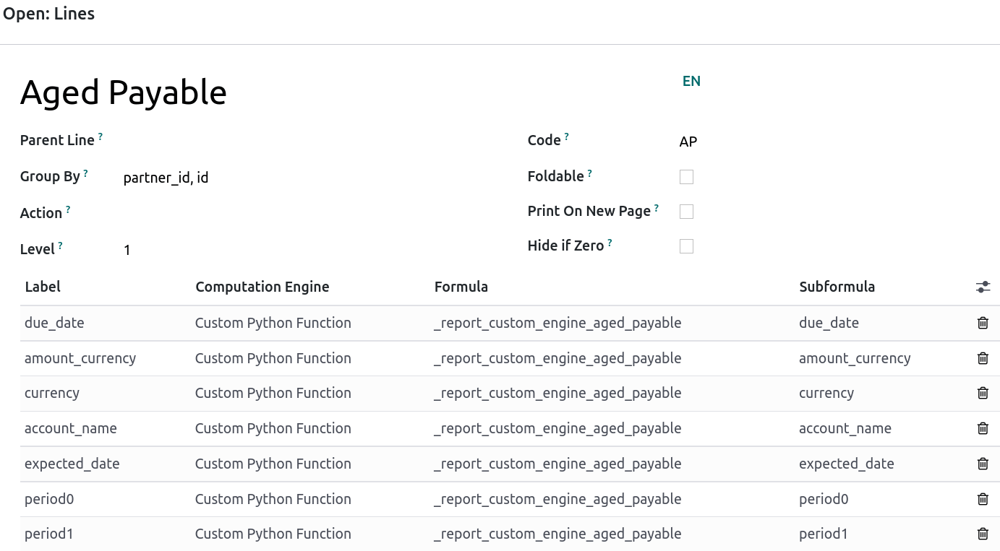
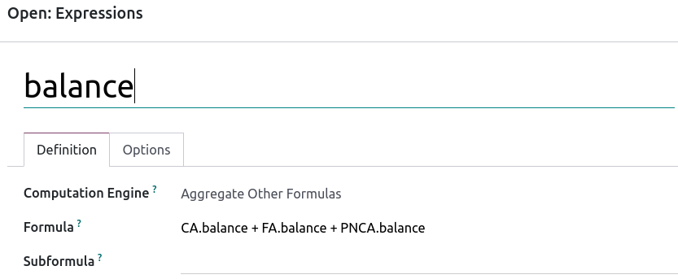

========================================
Create a report with customized formulas
========================================

Odoo comes with a powerful and easy-to-use reporting framework. The engine allows you to create new
reports, such as **tax reports**, or **balance sheets** and **income statements** with **specific
groupings** and **layouts**.

.. important::
   The :ref:`developer mode <developer-mode>` must be activated to access the accounting report
   creation interface.

Create a report
===============

In order to create a new report, go to :menuselection:`Accounting app --> Configuration -->
Management: Accounting Reports`. From here, you can either create a **root report** or a **variant**.

.. image:: customize/engine-accounting-reports.png
   :align: center
   :alt: Accounting reports engine.

Root reports
------------

Root reports can be regarded as generic, neutral accounting reports. They serve as models on which
local accounting versions are built. A tax report for Belgium and the US would both use the same
generic version as a base and adapt it for their domestic regulations.

When creating a new root report, you need to create a **menu item** for it. To do so, open the
report and then on that same report, click on :menuselection:`Action --> Create Menu Item`. Refresh
the page and the report is now available under :menuselection:`Accounting --> Reporting`. If a
report has no root report, it is considered to be a root report itself.

.. note::
   Cases that require creating a new root report are rare; such as when the tax authorities of a
   country require a new and specific type of report.

.. image:: customize/engine-create-menu-item.png
   :align: center
   :alt: Create Menu Item button.

.. seealso::
    List of built-in main :doc:`root reports <../overview/main_reports>`.

Variants
--------

Variants are country-specific versions of root reports and, therefore, always refer to a root
report. To create a variant, simply select a generic (root) report in the :guilabel:`Root Report`
field when creating a new report.

When a root report is opened from one of the accounting app's main menus, all variants available for
that root are displayed in the variant selector in the top right corner of the view. In the
following image, :guilabel:`VAT Report (BE)` is the variant of the root :guilabel:`Generic Tax
report`.

.. image:: customize/engine-variant.png
   :align: center
   :alt: Report variant selection.

Lines
-----

After having created a report (either root or variant), you need to fill it with lines. You can
either create a new one by clicking on :guilabel:`Add a line`, or modify an existing line by
clicking on it. All lines *require* a :guilabel:`Name`, and can have an optional additional
:guilabel:`Code` (of your choice) if you wish to use their value in formulas.

Further options can be accessed by clicking on an existing line.
 

Expressions
-----------

Each line can contain one or multiple **expressions**. Expressions can be seen as **sub-variables**
needed by a report line. To access an expression, click on a line.

When creating an expression, you must attribute a :guilabel:`label` used to refer to that
expression. Therefore, it has to be **unique** among the expressions of each line. Both a
:guilabel:`Computation Engine` and a :guilabel:`Formula` must also be indicated. The **engine**
defines how your **formula(s)** and **subformula(s)** are interpreted. It is possible to mix
expressions using different computation engines under the same line if you need to.

.. note::
   Depending on the engine, :guilabel:`subformulas` may also be required.

'Odoo Domain' engine
~~~~~~~~~~~~~~~~~~~~

With this engine, a formula is interpreted as an :ref:`Odoo domain <reference/orm/domains>`
targeting `account.move.line` objects.

The subformula allows you to define how the move lines matching the domain are used to compute the
value of the expression:

- **sum** : The result is the sum of all the balances of the matched move lines;

- **sum_if_pos** : The result is the sum of all the balances of the matched move lines if this
  amount is positive. Else, it's `0`;

- **sum_if_neg** : The result is the sum of all the balances of the matched move lines if this
  amount is negative. Else, it's `0`;

- **count_rows** : The result is the number of sub-lines of this expression. If the parent line has
  a group-by value, this will correspond to the number of distinct grouping keys in the matched move
  lines. Else, it will be the number of matched move lines.

You can also put a `-` sign at the beginning of the subformula to **invert** the sign of the
result.

'Tax Tags' engine
~~~~~~~~~~~~~~~~~

A formula made for this engine consists of a name used to match tax tags. If such tags do not exist
when creating the expression, they will be created.

.. example::
   If the formula is **tag_name**, the engine matches tax tags **+tag_name** and **-tag_name**,
   creating them if necessary.

When evaluating the expression, the expression computation can roughly be expressed as: **(amount of
the move lines with** `+` **tag)** `-` **(amount of the move lines with** `-` **tag)**.

'Aggregate Other Formulas' engine
~~~~~~~~~~~~~~~~~~~~~~~~~~~~~~~~~

Use this engine when you need to perform arithmetic operations on the amounts obtained for other
expressions. Formula can be any expression with `+`, `-`, `/` and `*` operator. To refer to an
expression, use the code of its **parent line** and its **label** (ex. **CODE.label**).

**Subformulas** can be one of the following:

- **if_above(CUR(amount))**: The value of the arithmetic expression will be returned only if it's
  greater than the provided bound. Else, the result will be `0`;

- **if_below(CUR(amount))**: The value of the arithmetic expression will be returned only if it's
  lower than the provided bound. Else, the result will be `0`;

- **if_between(CUR1(amount1), CUR2(amount2))**: The value of the arithmetic expression will be
  returned only if it's strictly between the provided bounds. Else, it will be brought back to the
  closest bound.

`CUR` is the currency code in capital letters, and `amount` is the amount of the bound expressed in
that currency.

You can also use the `cross_report` subformula to match, if your expression refers to an expression
defined in another report.

'Prefix of Account Codes' engine
~~~~~~~~~~~~~~~~~~~~~~~~~~~~~~~~

This engine is used to match amounts made on accounts using the prefixes of these accounts' codes as
variables in an arithmetic expression.

.. example::
   | **21 + 10 - 5**
   | This formula adds the balances of the move lines made on accounts whose codes start with `21`
     and `10`, and subtracts the balance of the ones on the accounts with the prefix `5`.

It is also possible to ignore a selection of sub-prefixes.

.. example::
   | **21 + 10\\(101, 102) - 5\\(57)**
   | This formula works identically to the previous example but ignores the prefixes `101`, `102`,
     and `57`.

You can apply 'sub-filtering' on **credits and debits** using the `C` and `D` suffixes. In this
case, an account will only be considered if its prefix matches, *and* if the total balance of the
move lines made on this account is **credit/debit**.

.. example::
   Account `210001` has a balance of -42 and account `210002` has a balance of 25. The formula
   **21D** only matches the account `210002`, and hence returns 25. `210001` is not matched, as its
   balance is *credit*.
   
Prefix exclusions can be mixed with the `C` and `D` suffixes.

.. example::
   **21D + 10\\(101, 102)C - 5\\(57)**

To match the letter `C` or `D` in a prefix and not use it as a suffix, use an *empty* exclusion.

.. example::
   | **21D\\()**
   | This formula matches accounts whose code starts with `21D`, regardless of their balance sign.

'External Value' engine
~~~~~~~~~~~~~~~~~~~~~~~

The 'external value' engine is used to refer to **manual** and **carryover values**. Those values
are not stored using `account.move.line`, but with `account.report.external.value`. Each of these
objects directly points to the expression it impacts, so very little needs to be done about their
selection here.

**Formulas** can be one of the following:

- **sum** : If the result must be the sum of all the external values in the period;

- **most_recent**: If the result must be the value of the latest external value in the period.

In addition, **subformulas** can be used in two ways:

- **rounding=X** : Replacing **'X'** by a number, instructs to round the amount to X decimals;

- **editable** : indicates this expression can be edited manually, triggering the display of an icon
  in the report, allowing the user to perform this action.

Both subformulas can be mixed by separating them with a `;`.

.. example::
   **editable;rounding=2**
    | Is a correct subformula mixing both behaviors.

'Custom Python Function' engine
~~~~~~~~~~~~~~~~~~~~~~~~~~~~~~~

This engine is a means for developers to introduce custom computation of expressions on a
case-by-case basis. The formula is the name of a **python function** to call, and the subformula is
a **key** to fetch in the **dictionary** returned by this function. Use it only if you are making a
custom module of your own.

Columns
-------

Reports can have an **indefinite number** of columns to display. Each column gets its values from
the **expressions** declared on the **lines**. The field :guilabel:`expression_label` of the column
gives the label of the expressions whose value is displayed. If a line has no **expression** in that
field, then nothing is displayed for it in this column. If multiple columns are required, you must
use different **expression** labels.

.. image:: customize/engine-columns.png
   :align: center
   :alt: Columns of report.

WWhen using the **period comparison** feature found under the :guilabel:`Options` tab of an
accounting report, all columns are repeated in and for each period.
