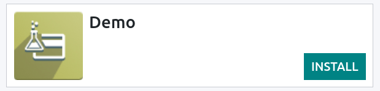

=====================
Demo payment provider
=====================

Odoo's **Demo Payment Provider** allows you to test business flows involving online transactions
without requiring real banking credentials.

.. seealso::
   :doc:`../payment_providers`

Installation
------------

Go to :menuselection:`Accounting or Website --> Configuration --> Payment Providers` and click
:guilabel:`Install` on the :guilabel:`Demo` payment provider. Then, switch its state to
:guilabel:`Test Mode`, and select a :guilabel:`Payment Journal`.

Configuration
-------------

The **Demo Payment Provider** has multiple configuration options that can be accessed by going to
:menuselection:`Accounting or Website app --> Configuration --> Payment Providers`.

Payment outcome
~~~~~~~~~~~~~~~

Upon checkout or when paying a bill online, you can choose the payment outcome when using the demo
payment provider. To do so, click on the :guilabel:`Payment Status` drop-down menu and select the
desired outcome.

.. image:: demo/demo-payment-outcome.png
   :align: center
   :alt: Payment status outcomes.

Transaction state
~~~~~~~~~~~~~~~~~

If you selected :guilabel:`Pending` as **payment outcome**, you can change the state of the
transaction straight from its form view. To access a transaction's form view, activate the
:ref:`developer mode <developer-mode>`,  and go to :menuselection:`Accounting or Website -->
Configuration --> Payment Transactions`. Then, change the status of a transaction by clicking on the
state bar (:guilabel:`Draft, Pending, Authorized, Confirmed, Canceled, Error`).

.. image:: demo/demo-view-form.png
   :align: center
   :alt: Transaction's status bar.

.. tip::
   You can also access the **transactions menu** by pressing **CTRL/⌘ + K** and searching for
   `/transactions`.

Displayed as
~~~~~~~~~~~~

Enter the name you wish the **Demo Provider** to appear as during the test. Leave the field blank if
you prefer to leave it as default *(Demo Payment Provider)*.

Supported payment icons
~~~~~~~~~~~~~~~~~~~~~~~

Select the icons of the supported payment methods you want to display, such as *VISA, PayPal, etc*.

Allow saving payment methods
~~~~~~~~~~~~~~~~~~~~~~~~~~~~

Also known as **tokenization**, this option allows saving the payment method for future
transactions. Check the :guilabel:`Allow Saving Payment Methods` box to enable the feature.

.. note::
   In the case of real transactions, you remain fully `PCI-compliant <https://en.wikipedia.org/wiki/
   Payment_Card_Industry_Data_Security_Standard>`_ when enabling this feature as Odoo does not store
   the card details directly. Instead, it creates a payment token that only holds a reference to the
   card details stored on the payment provider’s server.

Manual capture
~~~~~~~~~~~~~~

Enable :guilabel:`Capture Amount Manually` to test payment captures in two steps instead of one.
When you authorize a payment, the funds are (in the case of real transactions) reserved on the
customer's payment method but they are not immediately charged. The charge is only made when you
manually decide to capture the payment at a later date.

Availability
~~~~~~~~~~~~

It is possible to set a :guilabel:`Maximum Amount` up to which the provider is available. *Past*
that amount, it is no longer possible to select it as a payment option. It is also possible to
select countries in which the provider is available in the :guilabel:`Countries` field.

Refunds
~~~~~~~

You can refund payments directly from Odoo. To refund a payment, navigate to it by going to
:menuselection:`Accounting --> Customers --> Payments`, and then click on the :guilabel:`Refund`
button.

Fees
~~~~

Under the :guilabel:`Fee` tab, you can find the option to add **extra fees** on transactions. Once
the :guilabel:`Add Extra Fees` is box checked, the following options are available:

- :guilabel:`Fixed domestic fees` are determined by the amount entered in the field. The amount is
  then added to the tax-included price, and only applied to transactions occurring within the
  company's country configured in :doc:`General Settings <../../general/users/companies>`.
- :guilabel:`Fixed international fees` are similar to domestic fees, but apply only to
  international transactions.
- :guilabel:`Variable domestic fees (in percents)` are determined by the percentage entered in the
  field. The percentage is calculated on the tax-included price and then added to that price, but
  apply only to domestic transactions.
- :guilabel:`Variable international fees (in percents)` are determined by the percentage entered in
  the field. The percentage is calculated on the tax-included price and then added to that price,
  but apply only to international transactions.

Messages
~~~~~~~~

Under the :guilabel:`Messages` tab, you can configure different messages according to the **payment
state**.

- :guilabel:`Help Message`;
- :guilabel:`Pending Message`;
- :guilabel:`Authorize Message`;
- :guilabel:`Done Message`;
- :guilabel:`Canceled Message`.
