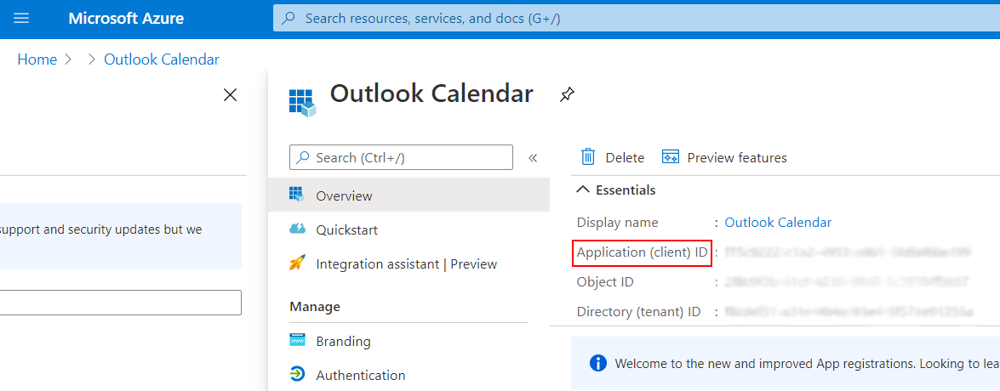

======================================
Synchronize Outlook Calendar with Odoo
======================================

Synchronizing a user's **main** Outlook Calendar with Odoo is useful for keeping track of their
tasks and appointments across all related applications.

Register the application with Microsoft Azure
=============================================

To sync the Outlook Calendar with Odoo's Calendar, a Microsoft Azure account is needed. Creating an
account is free for users who have never tried or paid for Azure. For more information, `click here
<https://azure.microsoft.com/en-us/free/?WT.mc_id=A261C142F>`_.

Refer to `Microsoft's documentation
<https://docs.microsoft.com/en-us/azure/active-directory/develop/quickstart-create-new-tenant>`_
on how to set up an Azure AD Tenant (also called an *environment*), which is a representation of an
organization to manage and register apps.

Then, `Register an Application
<https://docs.microsoft.com/en-us/azure/active-directory/develop/quickstart-register-app>`_,
choosing the appropriate supported account type. Users who wish to connect their Outlook calendar
to Odoo should select the :guilabel:`Accounts in any organizational directory (Any Azure AD
directory - Multitenant and personal Microsoft accounts (e.g. Skype, Xbox)` option for
:guilabel:`Supported account types`.

When configuring the platform settings, choose :guilabel:`Web`.

.. image:: outlook_calendar/platform_configurations.png
   :align: center
   :alt: Adding a platform in Microsoft Azure for Outlook calendar sync in Odoo.

.. important::
   For the :guilabel:`Redirect URI restrictions`, copy the Odoo database URI (URL) followed by
   `/microsoft_account/authentication`. For example, 
   `(https://www.companyname.odoo.com/microsoft_account/authentication)`.

   .. image:: outlook_calendar/redirect_URIs.png
      :align: center
      :alt: Odoo's database URI that is accepted when Microsoft returns authentication.

   For more information on the restrictions and limitations of URIs, `check this page <https://docs.microsoft.com/en-us/azure/active-directory/develop/reply-url>`_.

Regarding credentials, the user **must** :guilabel:`Add a client secret`, which allows Odoo to
authenticate itself, requiring no interaction from the user's side. :guilabel:`Certificates` are
optional.

Since resetting the synchronization can be tricky, Odoo recommends setting the maximum allowed
:guilabel:`expiration date` for the Client Secret (24 months), so there is no need to
re-synchronize soon. 

Configuration in Odoo
=====================

In the Odoo database, go to :menuselection:`Settings --> General Settings` and activate the
:guilabel:`Outlook Calendar` feature.

.. image:: outlook_calendar/outlook_calendar.png
   :align: center
   :alt: Outlook Calendar feature activated in Odoo.

From the Microsoft Azure portal, under the :guilabel:`Overview` section, copy the
:guilabel:`Application (Client) ID`, and paste it into the :guilabel:`Client ID` field in Odoo.

In the Microsoft Azure portal, under the :guilabel:`Certificates & secrets` section, copy the
:guilabel:`Client Secret Value` and paste it into the :guilabel:`Client Secret` field in Odoo.

.. image:: outlook_calendar/client_secrets.png
   :align: center
   :alt: Client Secret token to be copied from Microsoft to Odoo.

.. _outlook_calendar/sync_with_outlook:

Sync with Outlook
=================

Warnings (before sync)
----------------------

Odoo highly recommends testing the Outlook calendar synchronization on a test database and a test
email address (that is not used for any other purpose) before attempting to sync the desired
Outlook Calendar with the user’s production database.

If the user has any past, present, or future events on their Odoo calendar before syncing their
Outlook calendar, Outlook will treat the events pulled from Odoo's calendar during the sync as new
events, causing an email notification to be sent from Outlook to all the event attendees.

To avoid unwanted emails being sent to all past, present, and future event attendees, the user must
add the events from the Odoo calendar to the Outlook calendar before the first ever sync, delete
the events from Odoo, and then start the sync. 

Even after synchronizing the Odoo Calendar with the Outlook calendar, Outlook will still send a
notification to all event participants every time an event is edited (created, deleted, unarchived,
or event date/time changed), with no exceptions. This is a limitation that cannot be fixed from
Odoo’s side.

After one user syncs their Outlook calendar to the Odoo database, unwanted email notifications are
unavoidable because the first synchronized user’s events will be in the Odoo Calendar. If the Odoo
database is shared amongst multiple users, and another user wants to sync their Outlook calendar
with Odoo Calendar, Outlook will again pull the existing Odoo Calendar events during the sync and
treat them as new events, causing Outlook to send email invitations to all event attendees.

In summary, once a user synchronizes their Outlook calendar with the Odoo calendar:

- Creating an event in Odoo causes Outlook to send an invitation to all event attendees.
- Deleting an event in Odoo causes Outlook to send a cancellation to all event attendees.
- Unarchiving an event in Odoo causes Outlook to send an invitation to all event attendees.
- Archiving an event in Odoo causes Outlook to send a cancellation to all event attendees.
- Adding a contact to an event causes Outlook to send an invitation to all event attendees.
- Removing a contact from an event causes Outlook to send a cancellation to all event attendees.

If the user decides to synchronize, Odoo suggests that the user sets the maximum allowed expiration
date for the Client Secret in Microsoft Azure’s portal, so there is no need to re-synchronize soon.
Each time the user needs to re-synchronize, the user will have to follow the same process of adding
the events from the Odoo calendar to the Outlook calendar, stopping the sync between Outlook and
Odoo, deleting the events from Odoo, and then starting the sync again.

Sync Odoo Calendar and Outlook
------------------------------

In the Odoo database, go to the :guilabel:`Calendar` module and click :guilabel:`Sync with
Outlook`. The page will redirect to a Microsoft login page, and the user is asked to log in to
their account, if they are not already, and grant the required permissions.

.. image:: outlook_calendar/sync_with_outlook.png
   :align: center
   :alt: Calendar view and the "Sync with Outlook" button in Odoo Calendar.

The synchronization is a two-way process, meaning that events are reconciled in both accounts
(Outlook and Odoo).

.. image:: outlook_calendar/synched_with_outlook.png
   :align: center
   :alt: View of Odoo Calendar synched with Outlook's Calendar.

.. note::
   All users that want to use the synchronization simply need to :ref:`sync their calendar with
   Outlook <outlook_calendar/sync_with_outlook>`. The configuration of Microsoft's Azure account
   is only done once, as Azure AD tenants' Client IDs and Client Secrets are unique, and represent
   an organization that helps the user to manage a specific instance of Microsoft cloud services
   for their internal and external users.

.. seealso::
   - :doc:`../../../productivity/mail_plugins/outlook`
   - :doc:`../google/google_calendar_credentials`