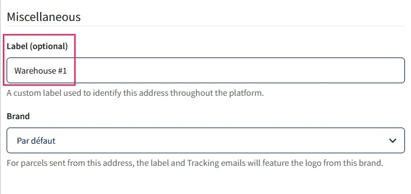
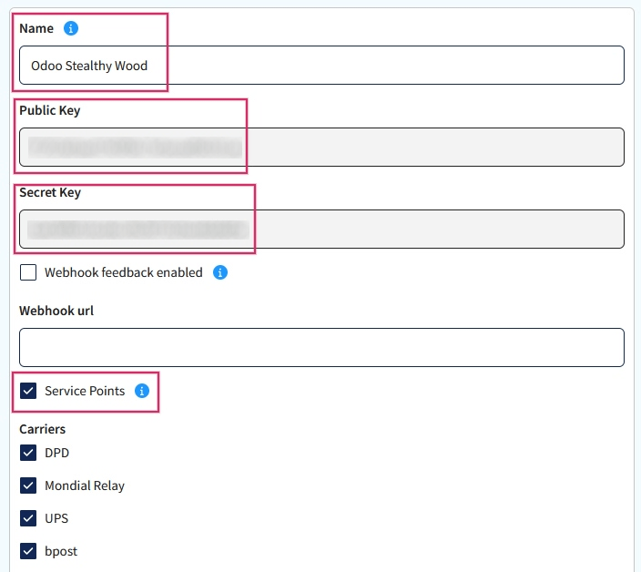
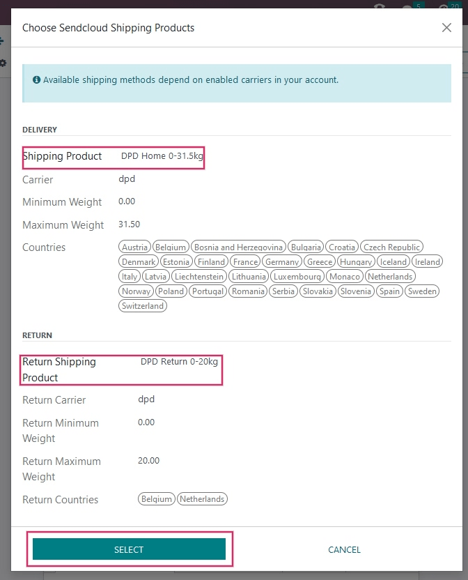

============================================
Setup of Sendcloud shipping services in Odoo
============================================

Odoo's compatibility with Sendcloud expands the amount of available shipping options. Sendcloud is
a shipping connectors aggregator. Sendcloud facilitates the integration of the most popular
European shipping carriers in one, easy-to-use tool.

Here is `Sendcloud's documentation <https://support.sendcloud.com/hc/en-us/articles/360059470491-
Odoo-integration>`_ on setting up the integration.

.. important::
   Odoo integration of Sendcloud will **not** work on free plans of Sendcloud.

Setup in Sendcloud
==================

Create an account and activate carriers
---------------------------------------

To get started, go to `Sendcloud's platform <https://www.sendcloud.com>`_ to configure the account
and generate the connector credentials. Log in with the Sendcloud account.

If the user does not have a Sendcloud account, fill in the contact information and payment details.
Sendcloud will ask for a VAT number or EORI number. After completing the account setup, activate
(or deactivate) the shipping carriers that Odoo will be shipping with.

Warehouse configuration
-----------------------

Once the Sendcloud account is created, set up the :guilabel:`Warehouse Address`. To do that, start
in the Sendcloud account and go to :menuselection:`Settings --> Shipping --> Addresses`. This is
where the :guilabel:`Warehouse address` should be entered.

.. image:: sendcloud_shipping/settings-shipping.png
   :align: center
   :alt: Adding addresses in the Sendcloud settings.

If the company would like Sendcloud to process returns as well, a :guilabel:`Return Address` is
required. Under the :guilabel:`Miscellaneous section`, there is a field called :guilabel:`Label
(optional)`. The Odoo Warehouse name should be entered here, and the characters should be exactly
the same.

An example of the Sendcloud Configuration:

An example of the Odoo Warehouse Configuration:

.. image:: sendcloud_shipping/odoo-warehouse.png
   :align: center
   :alt: Warehouse settings in Odoo.

Creating credentials
--------------------

In the Sendcloud account, navigate to :menuselection:`Settings --> Integrations` in the menu on the
right. Next, search for the :guilabel:`Sendcloud API`. Then, click on :guilabel:`Connect`.

.. tip::
   The integration that needs to be connected is the :guilabel:`Sendcloud API`. While there is an
   Odoo link in the :guilabel:`Integrations`, this only links the user to Sendcloud's help pages.

After clicking on :guilabel:`Connect`, the page will redirect to the :guilabel:`Sendcloud API`
settings page, where the :guilabel:`Public and Secret Keys` will be produced. The next step is to
name the :guilabel:`Integration`. The naming convention is as follows: `Odoo CompanyName`, with
the user's company name replacing `CompanyName`.

Then, check the box next to :guilabel:`Service Points` and select the shipping services for this
integration. There is no need to enter a :guilabel:`Webhook URL`, just save the work and the
:guilabel:`Pubic and Secret Keys` will be populated.

Setup in Odoo
=============

Install the Sendcloud Shipping module
-------------------------------------

After the Sendcloud account is set up and configured, the user can configure their Odoo database.
To get started, go to Odoo's :guilabel:`Apps` module and search for the :guilabel:`Sendcloud
Shipping` module. Then, activate this module, if it isn't already activated.

.. image:: sendcloud_shipping/sendcloud-mod.png
   :align: center
   :alt: Sendcloud Shipping module in the Odoo Apps module.

Sendcloud Shipping Connector configuration
------------------------------------------

Ensure the :guilabel:`Sendcloud Shipping Module` is activated in :menuselection:`Inventory -->
Configuration --> Settings`. The :guilabel:`Sendcloud Connector` setting is found under the
:guilabel:`Shipping Connectors` section.

After activating the :guilabel:`Sendcloud Connector`, click on the :guilabel:`Sendcloud Shipping
Methods` link below the listed connector. Once on the :guilabel:`Shipping Methods` page, click
:guilabel:`Create`.

.. tip::
   :guilabel:`Shipping Methods` can also be accessed by going to :menuselection:`Inventory -->
   Configuration --> Delivery --> Shipping Methods`.

Fill out the following fields in the :guilabel:`New Shipping Method` form:

- :guilabel:`Shipping Method`: type `Sendcloud DPD`.
- :guilabel:`Provider`: select :guilabel:`Sendcloud` from the drop-down menu.
- :guilabel:`Delivery Product`: set the product that was configured for this shipping method or
  create a new product.
- In the :guilabel:`SendCloud Configuration` tab, enter the :guilabel:`Sendcloud Public Key`.
- In the :guilabel:`SendCloud Configuration` tab, enter the :guilabel:`Sendcloud Secret Key`.
- Manually :guilabel:`Save` the form by clicking the cloud icon next to the :guilabel:`Shipping
  Methods / New` breadcrumbs.

After configuring and saving the form, follow these steps to load the shipping products:

- In the :guilabel:`SendCloud Configuration` tab of the :guilabel:`New Shipping Method` form, click
  on the :guilabel:`Load your SendCloud shipping products` link.
- Select the shipping products the company would like to use for deliveries and returns.
- Click :guilabel:`Select`.

For example:

.. tip::
   Sendcloud does not provide test keys when a company tests the sending of a package in Odoo. This
   means if a package is created, the configured Sendcloud account will be charged, unless the
   associated package is canceled within 24 hours of creation.

   Odoo has built an extra layer of protection into test environments. If the shipping method is
   used to create a label, then the labels are immediately canceled after the creation. This occurs
   automatically.

Generate a label with Sendcloud
-------------------------------

When creating a quotation in Odoo, add shipping and a :guilabel:`Sendcloud shipping product`. Then,
:guilabel:`Validate` the delivery. Shipping label documents will be automatically generated in the
chatter.

The following should be included in the shipping label documents:

#. :guilabel:`Shipping label(s)` (depending on the number of packages).
#. :guilabel:`Return label(s)` (if the Sendcloud connector is configured for returns).
#. :guilabel:`Customs document(s)` (should the destination country require them).

Additionally, the tracking number is also available.

.. note::
   If needed, shipping can be canceled by navigating to the :guilabel:`Additional info` tab of the
   delivery order.

.. note::
   When return labels are created, Sendcloud will automatically charge the configured Sendcloud
   account.

FAQ
===

Shipment is too heavy
---------------------

If the shipment is too heavy for the Sendcloud service that is configured, then the weight is split
to simulate multiple packages. Products will need to be put in different :guilabel:`Packages` to
:guilabel:`Validate` the transfer and generate labels.

:guilabel:`Rules` can also be set up in Sendcloud to use other shipping methods when the weight is
too heavy. However, it should be noted that these rules will not apply on the price calculation in
the Sales Order.

When using a personal carrier contract
--------------------------------------

If using a personal carrier contract in Sendcloud, and the user finds the price is not accurately
reflected when creating a quotation in Odoo, the pricing will need to be updated in Sendcloud.

Measuring volumetric weight
---------------------------

Many carriers have several measures for weight. There is the actual weight of the products in the
parcel, and there is the *volumetric weight*. A carrier may have different formulas to compute the
volumetric weight.
