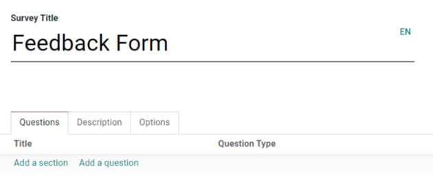
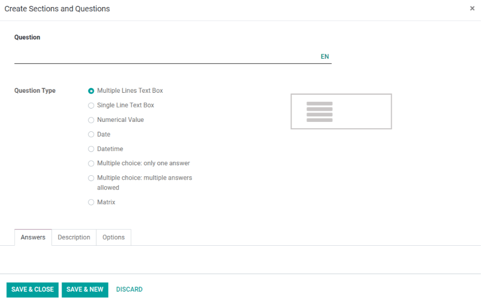
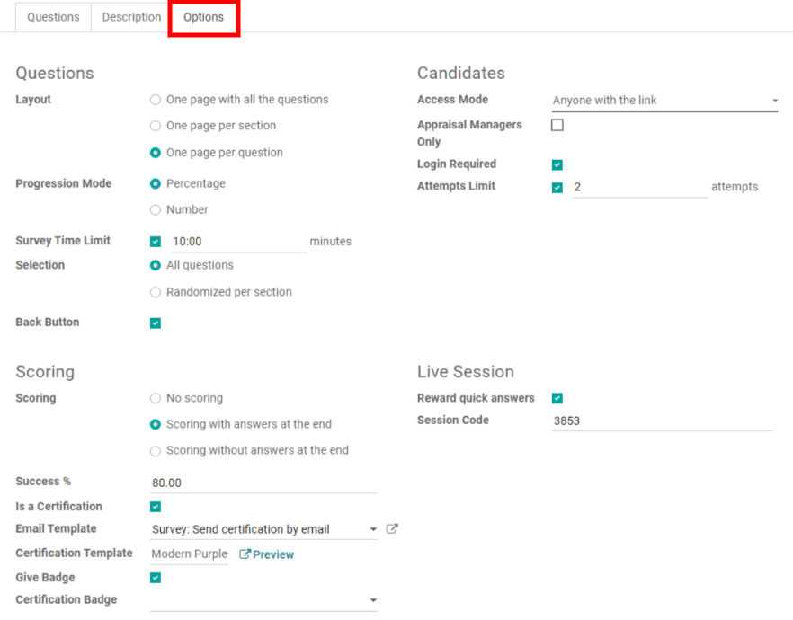

=================
Survey essentials
=================

Companies often use surveys to collect valuable information from their customers and/or employees,
which in turn, they use to make more informed business decisions.

Surveys can be used for a number of different purposes. They can be used to collect customer
feedback, evaluate the success of a recent event, measure the satisfaction of customers (or
employees), learn what the market is *really* thinking, and so much more.

Getting started
===============

To begin, open the :guilabel:`Surveys` application and click :guilabel:`Create` on the
:guilabel:`Surveys` dashboard.

Odoo redirects the page to a blank survey template form. 

First, choose a :guilabel:`Survey Title` for the survey. Next, add a cover image to the survey by
hovering over the photo icon and clicking on the pencil icon. Then, the file explorer will open and
the user can choose an image from their files. However, choosing an image is not required.

Below the :guilabel:`Survey Title` are various tabs in which the survey questions and format can be
created, customized, and configured. These tabs are labeled as follows: :guilabel:`Questions`,
:guilabel:`Description`, and :guilabel:`Options`.

Questions tab
=============

Add questions and sections to the survey in the :guilabel:`Questions` tab. A section will divide
the survey into parts; to make one, simply click :guilabel:`Add a section` and type in a section
name. Then, add questions or drag and drop questions into the divided sections.

Clicking :guilabel:`Add a question` opens the :guilabel:`Create Sections and Questions` pop-up to
create and customize the survey question.

Create questions
----------------

In the :guilabel:`Create Sections and Questions` pop-up, type the question in the
:guilabel:`Question` field.

After the question has been written in the :guilabel:`Question` field, choose the
:guilabel:`Question Type`. A preview of the question type is shown in the window as well.

Choose from the following :guilabel:`Question Types` :

- :guilabel:`Multiple Lines Text Box`
- :guilabel:`Single Line Text Box`
- :guilabel:`Numerical Value`
- :guilabel:`Date`
- :guilabel:`Datetime`
- :guilabel:`Multiple choice: only one answer`
- :guilabel:`Multiple choice: multiple answers allowed`
- :guilabel:`Matrix`

.. note::
   Different features will appear in the :guilabel:`Answers` and :guilabel:`Options` tabs,
   depending on the :guilabel:`Question Type` chosen. However, the :guilabel:`Description` tab
   will always remain the same, regardless of what question is chosen.

Create Sections and Questions tabs
~~~~~~~~~~~~~~~~~~~~~~~~~~~~~~~~~~

Once a :guilabel:`Question Type` has been selected, there are three possible tabs where information
can be customized for the question. These include the :guilabel:`Answers` (if applicable),
:guilabel:`Description`, and :guilabel:`Options` tabs. 

Each tab offers a variety of different features (depending on what :guilabel:`Question Type` was
chosen).

For example, in the :guilabel:`Options` tab, the following options may appear: 

- :guilabel:`Constraints`

    - :guilabel:`Mandatory Answer`
    - :guilabel:`Matrix Type`

- :guilabel:`Display`

  - :guilabel:`Number of columns`
  - :guilabel:`Images on answers`

- :guilabel:`Conditional Display`

    - :guilabel:`Conditional Display`

- :guilabel:`Allow Comments`

  - :guilabel:`Show Comments Field`
  
- :guilabel:`Live Sessions`

    - :guilabel:`Question Time Limit`

Conditional Display
*******************

:guilabel:`Conditional Display` means this question will only be displayed if the specified
conditional answer has been selected in a previous question.

If the box next to:guilabel:`Conditional Display` is selected, the :guilabel:`Triggering Question`
field appears.

Then, once a :guilabel:`Triggering Question` is picked, a :guilabel:`Triggering Answer` field
appears.

Here, select which answer will trigger this :guilabel:`Conditional Display` question.

.. note::
   Click :guilabel:`Save & Close`, and Odoo will redirect the page back to the survey template
   page. There is also the option to click :guilabel:`Save & New` which will open a new
   :guilabel:`Create Sections and Questions` pop-up.

Options tab
===========

Back on the main survey template form, under the :guilabel:Options` tab, there are different
sections of settings that can be modified.

The sections include:
- :guilabel:`Questions`
- :guilabel:`Scoring`
- :guilabel:`Candidates`
- :guilabel:`Live Session`

Questions
---------

The :guilabel:`Questions` section primarily focuses on the overall presentation of the survey.

First, select the :guilabel:`Layout` of the survey. The following options can be chosen:

- :guilabel:`One page with all the questions`
- :guilabel:`One page per section`
- :guilabel:`One page per question`

If either the :guilabel:`One page per section` or :guilabel:`One page per question` options are
chosen, then the :guilabel:`Back Button` option will appear. If selected, the :guilabel:`Back
Button` option will allow the participant to go back to a question during the survey. 

Under the :guilabel:`Layout` options is the :guilabel:`Progression Mode` setting, which indicates
how the participant's progress during the survey should be displayed. It can be shown as either a
:guilabel:`Percentage` or a :guilabel:`Number`.

Next, there is an option available to add a :guilabel:`Survey Time Limit`. To implement this option,
simply check the box, and enter the amount of time (in minutes) participants will have to complete
the survey.

After the :guilabel:`Survey Time Limit` option is a section labeled :guilabel:`Selection`. Here,
questions can be :guilabel:`Randomized per section`, in other words, the number of random questions
can be configured by section. This mode is ignored in a live session.

.. seealso::
    - :doc:`time_random`

Scoring
-------

In the :guilabel:`Scoring` section, decide how the survey should be scored. 

The following options can be chosen:

- :guilabel:`No scoring`
- :guilabel:`Scoring with answers at the end`
- :guilabel:`Scoring without answers at the end`

If either the :guilabel:`Scoring with answers at the end` or :guilabel:`Scoring without answers at
the end` options are selected then a :guilabel:`Success %` field will appear. Set the percentage of
correct answers needed to pass the survey. 

Next, there is the option to make the survey a certification. To do so, check the box next to the
option labeled :guilabel:`Is a Certification`," and two additional fields will appear.  

A color theme can be selected in the :guilabel:`Certification Template` field and an
:guilabel:`Email Template` can be chosen. When someone passes the certification with the required
score an email will automatically be sent to that person using the selected email template. The
survey participant can also receive a badge upon passing the certification if the :guilabel:`Give
Badge` feature is enabled and the :guilabel:`Certification Badge` is set.

.. seealso::
    - :doc:`scoring`

Candidates
----------

In the :guilabel:`Candidates` section, access to the survey can be managed.

The :guilabel:`Access Mode` has two options to choose between: :guilabel:`Anyone with the link`
and :guilabel:`Invited people only`. 

Below the :guilabel:`Appraisal Managers Only` checkbox, is the :guilabel:`Login Required` option to
require a login in order to participate in this survey. If this option is activated, then an
:guilabel:`Attempts Limit` field will populate, in which the number of survey attempts can be
defined for the person taking the survey/certification.

Live Session
------------

The :guilabel:`Live Session` section is dedicated to users who are conducting :guilabel:`Live
Session` surveys, wherein they directly engage with an audience and gather their answers in
real-time.

Here, the specific :guilabel:`Session Code` can be customized; this will be needed for participants
to access the live session survey. Reward participants for quick answers by selecting the checkbox 
labeled :guilabel:`Reward quick answers`. Attendees will get more points if they answer quickly.

Description tab
===============

Back on the main survey template page is the :guilabel:`Description` tab where a custom description
of the survey can be added. This will be displayed beneath the title on the survey's homepage,
which is on the front end of the website made through the Odoo :guilabel:`Website` app.

.. image:: create/survey-description-tab.png
   :align: center
   :alt: The back-end view of how the survey description looks.

Here's what the survey description looks like on the front end of the website:

.. image:: create/front-end-description.png
   :align: center
   :alt: The front-end view of how the survey description looks.

Test & share the survey
=======================

Once everything is created and saved, the survey can be tested to check for possible errors before
sending it out to the participants.

To do that, simply click :guilabel:`Test` in the upper left corner of the survey template page.

.. image:: create/test-survey-button.png
   :align: center
   :alt: The Test button on the survey template form.

When clicked, Odoo redirects the page to a test version of the survey on the front end of the
website, this page displays how the survey will look to participants. Proceed to run through the
survey, like a normal participant, and check for errors.

To return to the survey template form in the backend, simply click the 
:guilabel:`This is a test survey. Edit Survey` link in the blue banner along the top of the page.

.. image:: create/blue-banner-test.png
   :align: center
   :alt: The blue banner on the test survey with the edit link.

Once Odoo redirects the page to the survey template in the backend; make any necessary changes
before officially sending the survey out to potential participants.

When the survey is ready to share with the audience, click the :guilabel:`Start Survey` button in
the upper-left corner of the survey template form. Then, click :guilabel:`Share`. 

In the pop-up window, add the survey recipients in the :guilabel:`Recipients` field (for existing 
contacts in the Odoo database) or the :guilabel:`Additional emails` field (for contacts that do not want to be
listed in the Odoo database). Finally, click :guilabel:`Send`.

As answers get collected, check them by clicking the :guilabel:`Answers` smart button on the survey
template form, or the :guilabel:`See Results` button in the upper left corner. To end the survey,
click the :guilabel:`Close` button on the survey template form. 

.. seealso::
    - :doc:`scoring`
    - :doc:`time_random`
