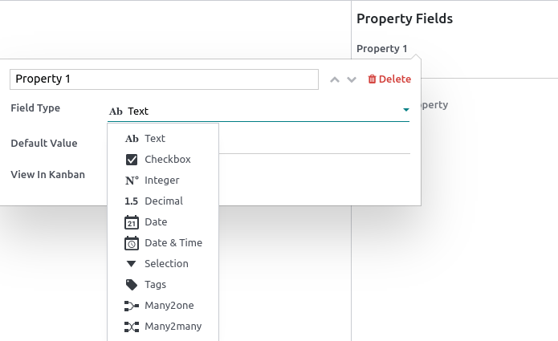

==========
Properties
==========

Properties are fields containing data and that can be added to articles by any user with **write**
access. These fields are shared between all the child articles and article items that are under the
same parent.

.. note::
   To be able to add properties, an article must be either a **child article** or an **article
   item**.

Add property fields
===================

Hover above the first-level header to make the buttons appear. Click on
:menuselection:`⚙ Add Properties --> Field Type`, select the type and add a default value if needed.
To make the fields appear in **kanban views**, check :guilabel:`View in Kanban` as well. To validate
and close the property creation window, click anywhere.

The different types assess what the field content can be:

.. list-table::
   :widths: 20 80
   :header-rows: 1
   :stub-columns: 1

   * - Types
     - Uses
   * - :guilabel:`Text`
     - Allows adding any content with no restriction.
   * - :guilabel:`Checkbox`
     - Add a checkbox.
   * - :guilabel:`Integer`
     - Allows adding integer numbers.
   * - :guilabel:`Decimal`
     - Allows adding any number.
   * - :guilabel:`Date`
     - Allows selecting a date.
   * - :guilabel:`Date & Time`
     - Allows selecting a date and time.
   * - :guilabel:`Selection`
     - | Add a drop-down selection menu with restricted values that have been set at the property
         creation.
       | To set it up, click :menuselection:`Add a property --> Field Type --> Selection -->
         Add values --> Enter predetermined values --> Press enter to validate --> repeat --> Click
         anywhere to close the property creation window`. You can enter as many values as needed.
   * - :guilabel:`Tags`
     - | Allows creating as many tags as needed. You can choose from already created tags, or create
         new ones by typing them and pressing **enter** or clicking on
         :guilabel:`Create "new_tags"`.
       | To set it up, click in the field next to :guilabel:`Tags` and :menuselection:`enter your
         "new_tag" --> Create "new_tag"` or :menuselection:`press enter --> click anywhere to close
         the window --> add "new_tag"` in the property field.
   * - :guilabel:`Many2one`
     - | Choose from a list of records that result from a model's domain. You can only select
         one result.
       | To set it up, click :menuselection:`Choose a model --> filter the results or show all
         records --> choose from those results`.
   * - :guilabel:`Many2many`
     - | Choose from a list of records that result from a model's domain. You can select as
         many results as needed.
       | To set it up, click :menuselection:`Choose a model --> filter the results or show all
         records --> choose from those results`.

Delete property fields
======================

To remove a property, click the **pencil** icon next to the targeted property, then click
:menuselection:`Delete --> Delete`.

.. warning::
   Once a property field is deleted, you cannot retrieve it.

Hide the property panel
=======================

To hide the property sidebar panel, click the :guilabel:`gear (⚙)` button.